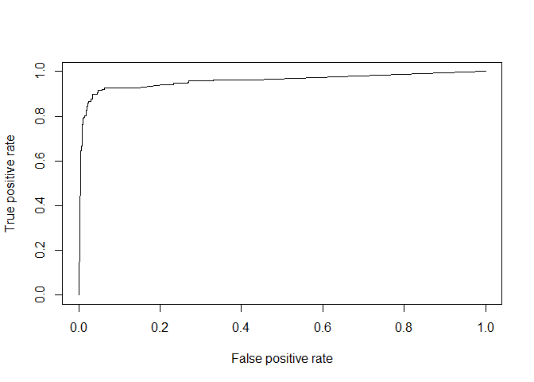
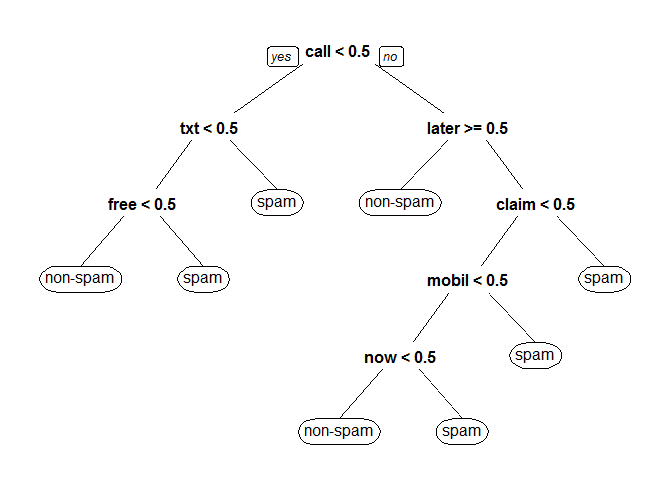
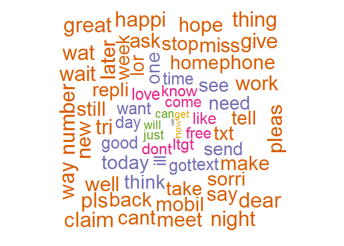

# SPAM-SMS-Classifier
Classifying SMS messages as SPAM/NON-SPAM based on their content.


Spam SMS prediction
================

Load libraries
==============

``` r
library(readr)
library(caTools)
library(e1071)
library(rpart)
library(rpart.plot)
library(wordcloud)
library(tm)
library(SnowballC)
library(ROCR)
library(pROC)
library(RColorBrewer)
library(stringr)
```

Get input
=========

``` r
sms <- read.csv("spam.csv", stringsAsFactors = F)
str(sms)
```

    ## 'data.frame':    5572 obs. of  5 variables:
    ##  $ v1 : chr  "ham" "ham" "spam" "ham" ...
    ##  $ v2 : chr  "Go until jurong point, crazy.. Available only in bugis n great world la e buffet... Cine there got amore wat..." "Ok lar... Joking wif u oni..." "Free entry in 2 a wkly comp to win FA Cup final tkts 21st May 2005. Text FA to 87121 to receive entry question(std txt rate)T&C"| __truncated__ "U dun say so early hor... U c already then say..." ...
    ##  $ X  : chr  "" "" "" "" ...
    ##  $ X.1: chr  "" "" "" "" ...
    ##  $ X.2: chr  "" "" "" "" ...

``` r
# remove empty columns
sms$X <- NULL
sms$X.1 <- NULL
sms$X.2 <- NULL

names(sms) <- c("label","message")
levels(as.factor(sms$label))
```

    ## [1] "ham"  "spam"

``` r
sms$label[sms$label == "ham"] <- "non-spam"
sms$label[sms$label == "spam"] <- "spam"

sms$label <- factor(sms$label)
```

Text Analysis
=============

Clean text for analysis
-----------------------

``` r
# create bag of words from text

bag <- Corpus(VectorSource(sms$message))

bag <- tm_map(bag, tolower)

bag <- tm_map(bag, PlainTextDocument)

bag <- tm_map(bag, removePunctuation)

bag <- tm_map(bag, removeWords, c(stopwords("english")))

bag <- tm_map(bag, stripWhitespace)

bag <- tm_map(bag, stemDocument)
```

Convert bag of words to data frame
----------------------------------

``` r
frequencies <- DocumentTermMatrix(bag)

 # look at words that appear atleast 200 times
findFreqTerms(frequencies, lowfreq = 200)
```

    ##  [1] "call" "can"  "come" "day"  "dont" "free" "get"  "good" "got"  "ill" 
    ## [11] "just" "know" "like" "love" "ltgt" "now"  "send" "text" "time" "want"
    ## [21] "will"

``` r
sparseWords <- removeSparseTerms(frequencies, 0.995)

 # convert the matrix of sparse words to data frame
sparseWords <- as.data.frame(as.matrix(sparseWords))

 # rename column names to proper format in order to be used by R
colnames(sparseWords) <- make.names(colnames(sparseWords))

str(sparseWords)
```

    ## 'data.frame':    5572 obs. of  316 variables:
    ##  $ X150ppm  : num  0 0 0 0 0 0 0 0 0 0 ...
    ##  $ X1st     : num  0 0 0 0 0 0 0 0 0 0 ...
    ##  $ X2nd     : num  0 0 0 0 0 0 0 0 0 0 ...
    ##  $ å1000    : num  0 0 0 0 0 0 0 0 0 0 ...
    ##  $ å2000    : num  0 0 0 0 0 0 0 0 0 0 ...
    ##  $ account  : num  0 0 0 0 0 0 0 0 0 0 ...
    ##  $ actual   : num  0 0 0 0 0 0 0 0 0 0 ...
    ##  $ afternoon: num  0 0 0 0 0 0 0 0 0 0 ...
    ##  $ aight    : num  0 0 0 0 0 0 0 0 0 0 ...
    ##  $ alreadi  : num  0 0 0 1 0 0 0 0 0 0 ...
    ##  $ also     : num  0 0 0 0 0 0 0 0 0 0 ...
    ##  $ alway    : num  0 0 0 0 0 0 0 0 0 0 ...
    ##  $ amp      : num  0 0 0 0 0 0 0 0 0 0 ...
    ##  $ anoth    : num  0 0 0 0 0 0 0 0 0 0 ...
    ##  $ answer   : num  0 0 0 0 0 0 0 0 0 0 ...
    ##  $ anyth    : num  0 0 0 0 0 0 0 0 0 0 ...
    ##  $ anyway   : num  0 0 0 0 0 0 0 0 0 0 ...
    ##  $ appli    : num  0 0 1 0 0 0 0 0 0 0 ...
    ##  $ around   : num  0 0 0 0 1 0 0 0 0 0 ...
    ##  $ ask      : num  0 0 0 0 0 0 0 0 0 0 ...
    ##  $ await    : num  0 0 0 0 0 0 0 0 0 0 ...
    ##  $ award    : num  0 0 0 0 0 0 0 0 0 0 ...
    ##  $ babe     : num  0 0 0 0 0 0 0 0 0 0 ...
    ##  $ babi     : num  0 0 0 0 0 0 0 0 0 0 ...
    ##  $ back     : num  0 0 0 0 0 1 0 0 0 0 ...
    ##  $ bad      : num  0 0 0 0 0 0 0 0 0 0 ...
    ##  $ bed      : num  0 0 0 0 0 0 0 0 0 0 ...
    ##  $ best     : num  0 0 0 0 0 0 0 0 0 0 ...
    ##  $ better   : num  0 0 0 0 0 0 0 0 0 0 ...
    ##  $ big      : num  0 0 0 0 0 0 0 0 0 0 ...
    ##  $ birthday : num  0 0 0 0 0 0 0 0 0 0 ...
    ##  $ bit      : num  0 0 0 0 0 0 0 0 0 0 ...
    ##  $ book     : num  0 0 0 0 0 0 0 0 0 0 ...
    ##  $ box      : num  0 0 0 0 0 0 0 0 0 0 ...
    ##  $ boy      : num  0 0 0 0 0 0 0 0 0 0 ...
    ##  $ bring    : num  0 0 0 0 0 0 0 0 0 0 ...
    ##  $ bus      : num  0 0 0 0 0 0 0 0 0 0 ...
    ##  $ buy      : num  0 0 0 0 0 0 0 0 0 0 ...
    ##  $ call     : num  0 0 0 0 0 0 0 0 1 1 ...
    ##  $ camera   : num  0 0 0 0 0 0 0 0 0 1 ...
    ##  $ can      : num  0 0 0 0 0 0 0 0 0 0 ...
    ##  $ cant     : num  0 0 0 0 0 0 0 0 0 0 ...
    ##  $ car      : num  0 0 0 0 0 0 0 0 0 0 ...
    ##  $ care     : num  0 0 0 0 0 0 0 0 0 0 ...
    ##  $ cash     : num  0 0 0 0 0 0 0 0 0 0 ...
    ##  $ chanc    : num  0 0 0 0 0 0 0 0 0 0 ...
    ##  $ chang    : num  0 0 0 0 0 0 0 0 0 0 ...
    ##  $ charg    : num  0 0 0 0 0 0 0 0 0 0 ...
    ##  $ chat     : num  0 0 0 0 0 0 0 0 0 0 ...
    ##  $ check    : num  0 0 0 0 0 0 0 0 0 0 ...
    ##  $ claim    : num  0 0 0 0 0 0 0 0 2 0 ...
    ##  $ class    : num  0 0 0 0 0 0 0 0 0 0 ...
    ##  $ code     : num  0 0 0 0 0 0 0 0 1 0 ...
    ##  $ collect  : num  0 0 0 0 0 0 0 0 0 0 ...
    ##  $ come     : num  0 0 0 0 0 0 0 0 0 0 ...
    ##  $ contact  : num  0 0 0 0 0 0 0 0 0 0 ...
    ##  $ cool     : num  0 0 0 0 0 0 0 0 0 0 ...
    ##  $ cos      : num  0 0 0 0 0 0 0 0 0 0 ...
    ##  $ cost     : num  0 0 0 0 0 0 0 0 0 0 ...
    ##  $ custom   : num  0 0 0 0 0 0 0 0 1 0 ...
    ##  $ dad      : num  0 0 0 0 0 0 0 0 0 0 ...
    ##  $ dat      : num  0 0 0 0 0 0 0 0 0 0 ...
    ##  $ date     : num  0 0 0 0 0 0 0 0 0 0 ...
    ##  $ day      : num  0 0 0 0 0 0 0 0 0 0 ...
    ##  $ dear     : num  0 0 0 0 0 0 0 0 0 0 ...
    ##  $ den      : num  0 0 0 0 0 0 0 0 0 0 ...
    ##  $ detail   : num  0 0 0 0 0 0 0 0 0 0 ...
    ##  $ didnt    : num  0 0 0 0 0 0 0 0 0 0 ...
    ##  $ dinner   : num  0 0 0 0 0 0 0 0 0 0 ...
    ##  $ done     : num  0 0 0 0 0 0 0 0 0 0 ...
    ##  $ dont     : num  0 0 0 0 1 0 0 0 0 0 ...
    ##  $ draw     : num  0 0 0 0 0 0 0 0 0 0 ...
    ##  $ drive    : num  0 0 0 0 0 0 0 0 0 0 ...
    ##  $ dun      : num  0 0 0 1 0 0 0 0 0 0 ...
    ##  $ dunno    : num  0 0 0 0 0 0 0 0 0 0 ...
    ##  $ earli    : num  0 0 0 1 0 0 0 0 0 0 ...
    ##  $ easi     : num  0 0 0 0 0 0 0 0 0 0 ...
    ##  $ eat      : num  0 0 0 0 0 0 0 0 0 0 ...
    ##  $ end      : num  0 0 0 0 0 0 0 0 0 0 ...
    ##  $ enjoy    : num  0 0 0 0 0 0 0 0 0 0 ...
    ##  $ enough   : num  0 0 0 0 0 0 0 0 0 0 ...
    ##  $ even     : num  0 0 0 0 0 0 1 0 0 0 ...
    ##  $ ever     : num  0 0 0 0 0 0 0 0 0 0 ...
    ##  $ everi    : num  0 0 0 0 0 0 0 0 0 0 ...
    ##  $ everyth  : num  0 0 0 0 0 0 0 0 0 0 ...
    ##  $ feel     : num  0 0 0 0 0 0 0 0 0 0 ...
    ##  $ final    : num  0 0 1 0 0 0 0 0 0 0 ...
    ##  $ find     : num  0 0 0 0 0 0 0 0 0 0 ...
    ##  $ fine     : num  0 0 0 0 0 0 0 0 0 0 ...
    ##  $ finish   : num  0 0 0 0 0 0 0 0 0 0 ...
    ##  $ first    : num  0 0 0 0 0 0 0 0 0 0 ...
    ##  $ forgot   : num  0 0 0 0 0 0 0 0 0 0 ...
    ##  $ free     : num  0 0 1 0 0 0 0 0 0 2 ...
    ##  $ friend   : num  0 0 0 0 0 0 0 1 0 0 ...
    ##  $ fuck     : num  0 0 0 0 0 0 0 0 0 0 ...
    ##  $ fun      : num  0 0 0 0 0 1 0 0 0 0 ...
    ##  $ game     : num  0 0 0 0 0 0 0 0 0 0 ...
    ##  $ get      : num  0 0 0 0 0 0 0 0 0 0 ...
    ##  $ girl     : num  0 0 0 0 0 0 0 0 0 0 ...
    ##   [list output truncated]

``` r
sparseWords$label <- sms$label
```

Predicting whether SMS is spam/non-spam
=======================================

split data into 75:25 and assign to train and test.
---------------------------------------------------

``` r
set.seed(987)
split <- sample.split(sparseWords$label, SplitRatio = 0.75)
train <- subset(sparseWords, split == T)
test <- subset(sparseWords, split == F)
```

Baseline Model(predicting every message as non-spam)
----------------------------------------------------

``` r
table(test$label)
```

    ## 
    ## non-spam     spam 
    ##     1206      187

``` r
print(paste("Predicting all messages as non-spam gives an accuracy of: ",
            100*round(table(test$label)[1]/nrow(test), 4), "%"))
```

    ## [1] "Predicting all messages as non-spam gives an accuracy of:  86.58 %"

Logistic Regression Model
-------------------------

``` r
glm.model <- glm(label ~ ., data = train, family = "binomial")
glm.predict <- predict(glm.model, test, type = "response")

### ROC curve

glm.ROCR <- prediction(glm.predict, test$label)
print(glm.AUC <- as.numeric(performance(glm.ROCR,"auc")@y.values))
```

    ## [1] 0.9580329

``` r
glm.prediction <- prediction(abs(glm.predict), test$label)
glm.performance <- performance(glm.prediction,"tpr","fpr")
plot(glm.performance)
```



``` r
### selecting threshold = 0.75 for spam filtering
table(test$label, glm.predict > 0.9)
```

    ##           
    ##            FALSE TRUE
    ##   non-spam  1176   30
    ##   spam        26  161

``` r
glm.accuracy.table <- as.data.frame(table(test$label, glm.predict > 0.9))
print(paste("logistic model accuracy:",
            100*round(((glm.accuracy.table$Freq[1]+glm.accuracy.table$Freq[4])/nrow(test)), 4),
            "%"))
```

    ## [1] "logistic model accuracy: 95.98 %"

Support Vector Machine Model
----------------------------

``` r
svm.model <- svm(label ~ ., data = train, kernel = "linear", cost = 0.1, gamma = 0.1)
svm.predict <- predict(svm.model, test)
table(test$label, svm.predict)
```

    ##           svm.predict
    ##            non-spam spam
    ##   non-spam     1184   22
    ##   spam           26  161

``` r
svm.accuracy.table <- as.data.frame(table(test$label, svm.predict))
print(paste("SVM accuracy:",
            100*round(((svm.accuracy.table$Freq[1]+svm.accuracy.table$Freq[4])/nrow(test)), 4),
            "%"))
```

    ## [1] "SVM accuracy: 96.55 %"

Decision Trees
--------------

``` r
tree.model <- rpart(label ~ ., data = train, method = "class", minbucket = 35)

# visualize the decision tree. It tells us about significant words.
prp(tree.model) 
```



``` r
tree.predict <- predict(tree.model, test, type = "class")
table(test$label, tree.predict)
```

    ##           tree.predict
    ##            non-spam spam
    ##   non-spam     1180   26
    ##   spam           96   91

``` r
rpart.accuracy.table <- as.data.frame(table(test$label, tree.predict))
print(paste("rpart (decision tree) accuracy:",
            100*round(((rpart.accuracy.table$Freq[1]+rpart.accuracy.table$Freq[4])/nrow(test)), 4),
            "%"))
```

    ## [1] "rpart (decision tree) accuracy: 91.24 %"

### SVM is the most accurate model but rpart is the most interpretable because it tells us about the words that play a significant role in detecting whether a SMS is SPAM or NON-SPAM.

Wordcloud
---------

``` r
bag <- TermDocumentMatrix(bag)
bag <- as.matrix(bag)
bag <- sort(rowSums(bag), decreasing = T)
bag.df <- data.frame(word = names(bag), freq = bag)

set.seed(154)
str(bag)
```

    ##  Named num [1:7804] 653 478 447 405 384 366 297 279 276 275 ...
    ##  - attr(*, "names")= chr [1:7804] "call" "now" "get" "can" ...

``` r
wordcloud(words = bag.df$word, freq = bag.df$freq, min.freq = 100,
          max.words=1500, random.order=FALSE, rot.per=0.25,
          colors=brewer.pal(8, "Dark2"),
          scale = c(0.5,3))
```


